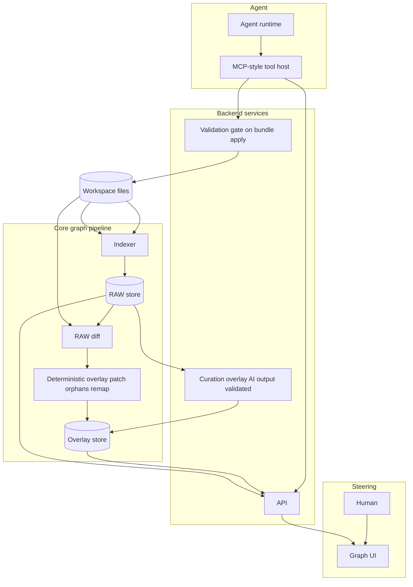

# Architecture (logical components)

**Status:** Living — must stay consistent with **[SPEC.md](./SPEC.md) §0–§9**. If this file and **SPEC** disagree, **fix one or both** and add a row to the **SPEC changelog**.

**Purpose:** One **picture** and **named boxes** for implementers: how **workspace**, **RAW**, **overlay**, **API**, **UI**, and **agent** connect. Not a deployment diagram (no K8s, no single-process assumption).

---

## 1. Diagram

**Read path:** human and agent both consume **RAW + overlay** through **API**; **UI** is graph-first. **Write path:** agent proposals go through **MCP-style tools** → **validation** → **workspace**; **indexer** recomputes **RAW**; **RAW diff** drives **deterministic overlay** maintenance; **curation** (optional job) fills or refreshes **friendly fields** under **validation ⊆ RAW ids**.

---

## 2. Components

| Component | Role |
|-----------|------|
| **Workspace** | Normal repo tree (`src/`, config, tests). **Source of file bytes**; Git and language tooling stay authoritative for **text**. |
| **Indexer** | Deterministic **RAW** build behind a **LanguageAdapter** boundary — **v1: Python** (Pyright-class + structure parse); **more languages** = more adapters, same core (**SPEC §7**, §9). |
| **RAW store** | Persisted graph: symbols, refs, use sites, content hashes / versions (**SPEC §4**). |
| **RAW diff** | Compare **before/after** index on **reparse**; emit structured events for **overlay** and **remap** (**SPEC §4**, §7). |
| **Deterministic overlay patch** | **Orphans**, **remap** hooks, **quarantine** — **no** model required for correctness (**SPEC §3**). |
| **Curation** | AI (or stub) **tree-walk** / delta pass: `displayName`, `userDescription`, grouping — **output validated** against **RAW ids** (**SPEC §4**). |
| **Overlay store** | Presentation keyed by **RAW ids**; **labels never replace ids** (**SPEC §3**). |
| **API** | Subgraph reads, overlay reads/writes allowed by policy, **apply** orchestration (**SPEC §6**). |
| **Graph UI** | Primary shell: **nodes**, exploded **appearances**, **layout-only** tweaks; **no** directory tree as main nav (**SPEC §2**, §5). |
| **Agent runtime** | Planner / executor that **does not** “discover” the repo by vibes alone — uses **index-backed** tools (**SPEC §6**). |
| **MCP-style tool host** | **Scoped** reads/writes: `get_raw_subgraph`, `get_overlay`, `apply_bundle`, etc. (**SPEC §13**). **Ship** as a **thin MCP server** + **HTTP** sharing one implementation; **LLM product** is usually **external** (IDE agent, CLI). |
| **Validation gate** | **§10.11-style** stack: types/linters, **graph invariants**, tests, human approvals where required — **before** treating a bundle as **done** (**SPEC §6**). |

---

## 3. Cross-cutting notes

- **Anchors** link **map** concepts to **paths** and **symbols** when **product graph** and **disk layout** diverge (**SPEC §5**).
- **Incomplete RAW** surfaces as **degraded / partial** regions in the UI — not as a **silent** complete graph (**SPEC §7**).
- **Scale:** cost is dominated by **index + store + payload shaping**, not only **curation** API calls (**SPEC §8**).
- **Tool hosts:** Implement **MCP** (and **HTTP**) as **thin adapters** over the **same** Python/API layer — **Cursor**, **VS Code**, **Claude**-class agents, and **scripts** attach with **config**, not separate domain stacks. See **[ROADMAP.md](./ROADMAP.md)** (*AI and tool hosts*).

---

## 4. POC vs product

- **`poc-brainstorm-ui/`** exercises **node UX** only; it is **not** this pipeline (**SPEC §12**).

---

## Changelog

| Date | Note |
|------|------|
| 2025-03-21 | Initial **logical** architecture (pass 3); aligned to **SPEC §0–§6**, §13 step 6. |
| 2026-03-21 | **Indexer** row + status ref **§9** (Python v1 adapter, expansion path). |
| 2026-03-22 | **Tool hosts:** MCP+HTTP shared layer; pointer to **ROADMAP** *AI and tool hosts*; MCP row clarifies thin server + external LLM hosts. |
