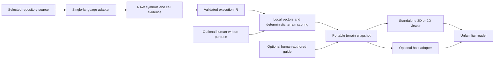

# Architecture

**Status:** Implemented logical architecture for the familiarization product.

## Pipeline

```mermaid
flowchart LR
  SRC[Selected repository source] --> ADAPTER[Single-language adapter]
  ADAPTER --> RAW[RAW symbols and call evidence]
  RAW --> IR[Validated execution IR]
  IR --> SCORE[Local vectors and deterministic terrain scoring]
  SCORE --> SNAP[Portable terrain snapshot]
  SNAP --> VIEWER[Standalone 3D or 2D viewer]
  SNAP --> HOST[Optional host adapter]
  VIEWER --> READER[Unfamiliar reader]
  HOST --> READER
  PURPOSE[Optional human-written purpose] --> SCORE
  GUIDE[Optional human-authored guide] --> SNAP
```

The source-to-snapshot path is build time. The standalone viewer serves static
JSON and local assets at runtime. Portfolio is represented by the optional host
box; it is not in the core path.

## Components

| Component | Responsibility |
|---|---|
| Source discovery | Select files and roots while excluding dependencies, generated output, hidden paths, declarations, minified files, and symlinks. |
| Language adapter | Parse one language and emit files, symbols, stable qualified names, direct call sites, hashes, parse status, and known limits. |
| RAW document | Preserve recomputable technical evidence in a shared schema. |
| Execution IR | Normalize function nodes, entry points, call confidence, source locations, and unresolved boundary nodes. |
| Code embedder | Produce normalized vectors and model/source receipts locally; cache by exact recipe and content. |
| Terrain scorer | Combine novelty, substance, bounded graph centrality, and optional human-purpose similarity. |
| Layout | Produce deterministic code-similarity and call-path coordinates and monotonic visual heights. |
| Snapshot exporter | Verify source hashes, remove source argument snippets, retain limits and evidence, and write portable JSON. |
| Guide validator | Attach optional human prose only when each stop resolves and adjacent stops have a mapped call. |
| Standalone packager | Copy one snapshot and built local viewer assets into a static directory. |
| Viewer | Render 3D terrain with selection and layout controls; fall back to an explorable Canvas 2D map. |
| Host adapter | Add host navigation, themes, project selection, or introductory prose without changing analysis. |

## Adapter seam

`flowcode.language_adapter.index_repo_auto()` discovers the selected language.
Python and browser adapters keep their established implementations. Java, C,
C#, and Haskell use `LanguageSpec` in `treesitter_indexer.py`, which concentrates
grammar module, syntax node types, extensions, and limitations in one place.

`execution_ir.treesitter_from_raw` consumes only the RAW contract. Downstream
embedding, scoring, layout, export, and browser code do not branch by language.
This is the seam for adding Kotlin or Go without duplicating the product.

## Honesty boundaries

- Static calls use `resolved`, `heuristic`, or `unknown` confidence.
- Ambiguous or untraced calls terminate at a visible language boundary.
- Adapter metadata reports partial or failed parsing.
- The snapshot calls height estimated importance and retains its formula.
- Unsupported mixed-language input fails before emitting a plausible partial map.
- Runtime viewer requests stay inside the generated site.

## Optional future summary

A generated summary would sit after `SNAP` as a separately invoked enrichment
artifact. It would never feed the adapter, IR, vector, scoring, or layout boxes.
The static viewer must remain functional when that artifact is absent.

## Historical branch

Earlier architecture placed an agent, MCP tool host, API, write bundles, and
validation gate around the graph. Those can be future consumers of snapshots or
IR. They are omitted here because the current product is read-only codebase
familiarization.
