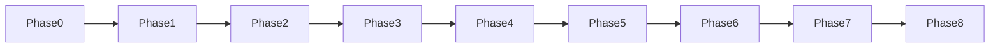

# Full development roadmap

**Purpose:** Ordered **phases** so work stays aligned with [SPEC.md](./SPEC.md) §0 and [ARCHITECTURE.md](./ARCHITECTURE.md). Use this when choosing what to build next; add **detail inside each phase** when you start it (tasks, tickets), not here.

**Rules**

- **Do not skip phases** unless you explicitly decide the exit criteria are already met (write that decision in SPEC changelog or a short note at the bottom of this file).
- If a idea conflicts with **SPEC §0**, **fix the idea or SPEC** before building.
- **Depth first on the canonical repo** ([`fixtures/golden-fastapi`](../../fixtures/golden-fastapi)); widen layouts only after a phase’s exit criteria hold there.

---

## North star (unchanging)

**You steer on a graph; the AI changes a normal Python repo under validation; RAW is truth from code; overlay is presentation keyed by RAW ids.**

---

## AI and tool hosts (cross-cutting strategy)

**Intent:** Solo / self-hosted v1 — **swap LLM products freely** (Cursor, Claude Code, VS Code + Copilot MCP, OpenCode, scripts) without rewriting **indexer, validation, or apply**.

| Layer | Own it? | Notes |
|-------|---------|--------|
| **Repo truth + bundles + validation** | **Yes** — core product | HTTP API (Phase 3+) and Python library; **SPEC §6**. |
| **MCP tool surface** | **Yes — thin** | One **stdio or streamable-HTTP MCP server** that calls the **same functions** as the API (no second indexer). Names align with **SPEC §13** (`get_raw_subgraph`, `get_overlay`, `apply_bundle`, …). |
| **LLM + chat UX** | **Prefer external hosts** | Use each product’s built-in agent where possible; **per-host config only** (e.g. `mcp.json`, env vars). **MCP** is the **portable** contract across major 2025–2026 clients ([Model Context Protocol](https://modelcontextprotocol.io/) ecosystem). |
| **Full in-house “AI platform”** | **Defer** | Avoid building auth, chat history, model routing, and streaming **before** Phases **4–5** are boring on **golden-fastapi**. Optional **minimal** graph-attached chat (user API keys) **later** must call the **same** backend — never duplicate RAW logic. |
| **Vendor-specific extensions** | **Only if needed** | If a host **lacks MCP**, add a **small shim** or use **HTTP from a script** — not a separate domain design per vendor. |

**Phase mapping:** **Phase 6** = MCP + fake-agent script exit; **Phase 7** = orchestration + approval + gates — the **runtime** may be Cursor, Claude Code, a local script, or a **thin** custom UI, all against the **same** tools.

**v1 delivery order (2026-03-21):** Implement the **shared capability layer** (HTTP + library) **first**; **primary** v1 UX is a **minimal in-house** graph shell that calls it. **MCP / OpenCode-style extensions** are **optional second doors** after that loop is credible on **`golden-fastapi`**. See **[v1-strategy.md](./v1-strategy.md)** for the full decision, sync invariants, and numbered next steps.

---

## Where we are now

| Phase | Status |
|-------|--------|
| **Phase 0** | **Done** — [`packages/raw-indexer`](../../packages/raw-indexer): AST **RAW** JSON, `diff`, `orphans`, `validate`, `apply-verify`; golden fixture in [`fixtures/golden-fastapi`](../../fixtures/golden-fastapi). |
| **Phase 1** | **Done** — [poc-brainstorm-ui](../../poc-brainstorm-ui): loads **`public/raw.json`**, **`src/rawGraph.ts`** maps dirs/files/symbols + import edges; **`npm run index:golden`** refreshes from the fixture. |
| **Phase 2** | **Done** — **`public/overlay.json`**, **`mergeOverlay`**, **`npm run check:orphans`**; `raw-indexer orphans` checks **`by_symbol_id`** + **`by_file_id`** (exit **1** if stale keys). |
| **Phase 3** | **Done (baseline)** — FastAPI in **`raw_indexer.api`**: **`GET /raw`**, **`GET /overlay`**, **`PATCH /overlay`** (reject orphans), **`POST /reindex`**; POC **`npm run dev:api`** + Vite proxy + **`scripts/brainstorm-api.sh`**. Default dev still uses static **`public/*.json`**; API path is opt-in. |
| **Phase 4** | **Done** — **`index_meta`**, per-file **`analysis`**, **`diff.remap`**, **`overlay-migrate`** CLI, optional **`index --diagnostics`** (Pyright JSON) + **`language_adapter`** boundary; POC **Index coverage** + **Type checker** panel when diagnostics present. |

---

## Phase sequence

### Phase 0 — Truth primitives (baseline)

**Goal:** Reproducible **repo → RAW → diff → validate → scripted apply** on the **canonical** Python web layout.

**Exit:** Same as today: CLI loop documented in `packages/raw-indexer/README.md`; tests green.

---

### Phase 1 — Graph reads RAW

**Goal:** The **graph UI** reflects **real** indexer output, not only mocks.

**Build (summary):** Load `raw.json` in [poc-brainstorm-ui](../../poc-brainstorm-ui/) (file drop, static asset, or dev server proxy); map `files` / `symbols` / `edges` to nodes and edges; one **refresh** path from repo → index → UI.

**Exit:** Opening the POC against the **golden** index shows structure you can **verify** against `raw.json` by inspection.

**Avoid:** Perfect layout algorithms, new node models, or agent features before this works.

---

### Phase 2 — Overlay in the loop

**Goal:** **Friendly layer** is real data, not copy-pasted labels.

**Build (summary):** Versioned **`overlay.json`** (or equivalent) keyed by **RAW symbol ids**; UI **merges** overlay for `displayName` / `userDescription`; wire **`orphans`** into a repeatable check (script or CI).

**Exit:** Rename a symbol in **overlay**; re-index; **orphans** report stale keys; fixing overlay is **mechanical**.

**Avoid:** Letting the LLM own overlay keys without validation against RAW ids.

---

### Phase 3 — API shell

**Goal:** UI and future agent talk to a **single backend** instead of ad hoc files.

**Build (summary):** Small service (Python): **GET** RAW subgraph + overlay slice; **PATCH** overlay (validated); later **POST** apply (stub). Persist RAW snapshot or **SQLite** if files are no longer enough.

**Exit:** POC loads graph **only** via API for golden repo; indexer runs **server-side** or as a library the server invokes.

**Avoid:** Auth, multi-tenant, scaling—solo **self-hosted** v1 only.

---

### Phase 4 — Indexer hardening + honesty

**Goal:** Refactors and **partial analysis** are **explicit**, not silent.

**Build (summary):** Document **`index_meta`** + per-file parse **`analysis`**; **`diff` → `remap`**; **`overlay-migrate`** applies remap to **`overlay.json`** (with **`--dry-run`** / **`--include-medium`**); **`index --diagnostics`** attaches **Pyright/Basedpyright** JSON; **`raw_indexer.language_adapter`** documents the v0 Python boundary (SPEC §9.3); POC surfaces coverage + optional type summary.

**Exit:** **Mechanical** overlay path after id drift: **diff + remap + overlay-migrate + orphans**; **degraded** indexing and **optional** type-check payload are **labeled** in RAW / UI.

**Avoid:** Second language adapter before this is **boring** on one repo.

---

### Phase 5 — Productized bundle apply

**Goal:** “Land a change” is **one** supported path with the same guarantees as today’s `apply-verify`.

**Build (summary):** Formal **bundle** schema (files + overlay ops); **apply** endpoint or CLI that writes, **reindexes**, runs **validation stack** (SPEC §6), returns structured **pass/fail** + logs.

**Exit:** No ad hoc shell scripts required to demo **edit → validate** on golden + **one** extra real project.

---

### Phase 6 — MCP-shaped tools

**Goal:** Agent-sized **interfaces** match [ARCHITECTURE.md](./ARCHITECTURE.md) without committing to a full LLM product.

**Build (summary):** Implement **`get_raw_subgraph`**, **`get_overlay`**, **`apply_bundle`** (names per SPEC §13) as a **shared Python capability layer**, then expose it as: (1) **HTTP** routes where not already present (consumable by the **in-house** shell per **[v1-strategy.md](./v1-strategy.md)**), and (2) a **thin MCP server** (stdio first; HTTP MCP if useful for remote hosts). Document **example configs** for attaching the same server from **Cursor**, **VS Code**, and **Claude**-class clients (exact filenames evolve — link to repo runbook when it exists).

**Exit:** A **fake agent** (HTTP client script counts) can complete a **small** end-to-end task using **only** these capabilities **on golden-fastapi**; **and** at least one **real MCP-capable host** can invoke the MCP server successfully **once** the in-house reference path exists (ordering per **v1-strategy.md**).

**Avoid:** Bespoke **per-vendor** tool implementations; **N×** indexers for **N** chat products.

---

### Phase 7 — Agent loop v0

**Goal:** **Goals**, **diffs**, **approvals**, **check-ins** (stub) on top of Phase 6.

**Build (summary):** Orchestrator that calls tools, presents **bundle** for **human approve/reject**, handles **validation failure** with structured retry; optional **cheap** model for copy; **stronger** model only where needed (per your cost strategy). The **orchestrator** may be **external** (user’s IDE agent + MCP) or a **small local** process — not required to ship a **full** custom chat product.

**Exit:** You can describe a **goal** on a node and get a **reviewable** change set on the **canonical** repo, landed only after **gates**.

**Avoid:** Full autonomy, multi-repo, or “never touch code” absolutism—escape hatches stay honest.

---

### Phase 8 — v1 product polish (solo)

**Goal:** [how-to-use.md](../planning/how-to-use.md) flows are **credible** on one machine.

**Build (summary):** **Bootstrap** empty / thin-index UX (template skeleton + honest states); **draft nodes** (UI-only, not RAW—planning reference); **per-node test** hooks or links; **self-host** story (runbook: indexer + API + UI + Tailscale or localhost).

**Exit:** A second person could follow a **short runbook** and believe the **vision** without reading brainstorming.

---

## Sidetrack guard (do not chase early)

| Temptation | Why wait |
|------------|----------|
| Second **language** adapter | Phase **4** solid on **Python** first (SPEC §9.4). |
| **Monorepo** / multi-package | After **Phase 5** on **single-package** canonical shape. |
| **Pretty** graph only | **Phase 1** must prove **data binding** to RAW. |
| **Full IDE** / directory tree as primary nav | Contradicts SPEC §2; at most a **power** escape hatch later. |
| **Blueprint wiring** as programming model | SPEC §11 non-goal. |
| Hosted **SaaS**, billing, teams | Audience is **solo self-hosted** v1. |
| **Custom AI platform** (accounts, chat infra, model marketplace) before **Phase 5** | Core value is **validate + apply + RAW honesty**; use **existing** MCP-capable hosts for the LLM. (**Phase 4** honesty baseline is **done**.) |
| **Vendor extension** as the **only** integration | Prefer **MCP + HTTP** so **Cursor / VS Code / Claude / scripts** share one backend; extensions only as **shims**. |

---

## When this file changes

Update the **Phase 0** table and **changelog** below when a phase completes or is **split/merged**. If scope shifts, update **SPEC** first, then this roadmap.

### Roadmap changelog

| Date | Note |
|------|------|
| 2026-03-22 | Initial **Phase 0–8** roadmap aligned to SPEC + current `raw-indexer` baseline. |
| 2026-03-22 | **Phase 1** marked **Done** (POC wired to real RAW JSON). |
| 2026-03-22 | **Phase 2** marked **Done** (overlay merge + orphan check for symbols + files). |
| 2026-03-22 | **AI & tool hosts** strategy: platform-agnostic **MCP + HTTP**, defer in-house chat platform; **Phase 6–7** text aligned (thin MCP, fake agent + real host attach). |
| 2026-03-22 | **Phase 4** baseline: **`index_meta`** + file **`analysis`** in indexer; POC coverage panel (**Phase 4** row **In progress**). |
| 2026-03-22 | **`diff` remap hints**: `remap_hints.py` + **`remap`** block in diff JSON (high/medium symbol + file pairs, ambiguous buckets); tests in **`test_remap_hints.py`**. |
| 2026-03-22 | **Phase 4 complete**: **`overlay-migrate`**, **`index --diagnostics`**, **`diagnostics_pyright`**, **`language_adapter`**; POC type-check panel; roadmap exit updated. |
| 2026-03-21 | **v1 delivery order**: pointer to **[v1-strategy.md](./v1-strategy.md)** — in-house graph shell + HTTP spine **before** MCP as primary; Phase **6** build/exit text aligned. |
